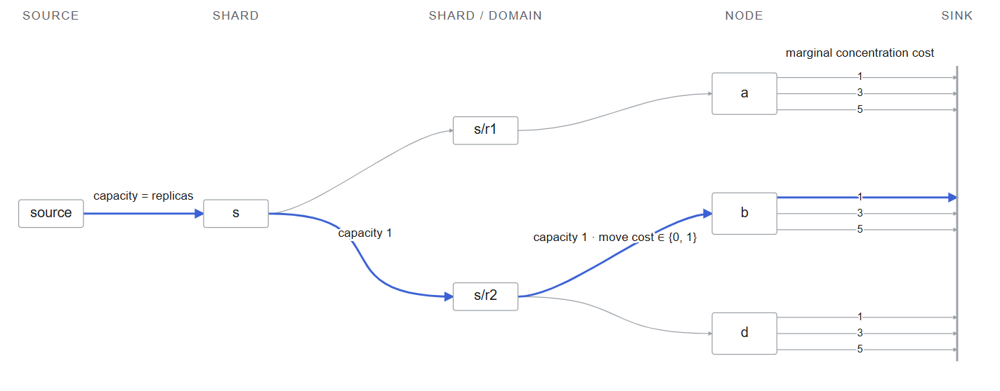

# ShardFlow: Shard Placement with Checkable Proofs

Adding, removing, or draining machines in a storage cluster can require replicated data to move. A good planner must restore every required replica without overloading nodes, placing two copies in the same failure domain, or moving more replicas than necessary.

ShardFlow computes these placements deterministically. It models the problem as min-cost flow, first minimizing replica movement and then the sum of squared node loads. Every result carries a certificate. A successful placement includes vertex potentials certifying optimality, while an infeasible result includes a cut proving that no valid placement exists. `Verify` checks either certificate without rerunning the optimizer.



*Figure 1: Shard placement as min-cost flow*  
*One shard slice, one replica in blue. 3 slots shown, load pooled across shards.*

## Overview

The planner receives:

- nodes, each with a stable ID, failure domain, and replica capacity;
- shards, each with a stable ID and required replica count;
- an optional previous placement.

It assigns every replica to a node under three hard constraints:

1. no node exceeds its capacity;
2. one shard can't appear twice on the same node;
3. replicas of the same shard must be spread across different failure domains.

Among all valid placements, ShardFlow minimizes this pair:

```text
(new replica moves, sum of squared node loads)
```

The pair is ordered lexicographically. Avoiding one replica move takes priority over every possible improvement to load concentration. Keeping the components separate avoids choosing a scalar weight that might silently change that priority as the cluster grows.

The result is either a placement with an optimality certificate or an infeasibility certificate. `Verify` checks either result without rerunning the optimizer.

## Example

This example drains node `c`. Shard `y` keeps its replica on node `d`, so its replacement must use rack `r1`.

```go
nodes := []shardflow.Node{
	{ID: "a", Domain: "r1", Capacity: 1},
	{ID: "b", Domain: "r2", Capacity: 1},
	{ID: "d", Domain: "r2", Capacity: 1},
}
shards := []shardflow.Shard{
	{ID: "x", Replicas: 1},
	{ID: "y", Replicas: 2},
}
old := shardflow.Placement{
	{Shard: "x", Nodes: []shardflow.NodeID{"c"}},
	{Shard: "y", Nodes: []shardflow.NodeID{"c", "d"}},
}

result, err := shardflow.Place(nodes, shards, old)
if err != nil {
	return err
}
if err := shardflow.Verify(nodes, shards, old, result); err != nil {
	return err
}
```

The resulting placement is:

```text
x -> b
y -> a, d
objective -> (2 moves, 3 concentration)
```

A greedy pass that puts `x` on `a` first leaves no valid replacement for `y`. The residual network instead reroutes `x` to `b`, freeing `a` for `y`.

## How it works

ShardFlow builds a residual network with five layers:

```text
source -> shard -> shard/domain -> node -> sink
```

Each unit of integral flow chooses one shard, one failure domain, one node, and one unit of node capacity. Capacity one on each shard/domain edge prevents two replicas of the same shard from entering one failure domain. A shard/domain-to-node edge costs zero when it retains an old replica and one move otherwise.

For load balancing, node slot `k` has concentration cost `2*k-1`. Filling the first `L` slots therefore contributes exactly:

```text
1 + 3 + ... + (2*L-1) = L*L
```

The slot costs are strictly increasing. If a flow used slot `k` while a lower slot `j < k` was unused, moving that unit to `j` would lower the cost without changing the placement. So if a node receives `L` replicas, the cheapest choice is its first `L` slots, for a total concentration cost of exactly `L*L`.

This converts the convex squared-load objective into linear edge costs. The solver uses successive shortest augmenting paths with pair-valued costs and vertex potentials, so the lexicographic objective is preserved throughout the algorithm.

## Why the certificates work

A successful `Solution` includes the placement, objective, and one potential per residual-network vertex. `Verify` reconstructs the flow and checks that every residual edge has nonnegative reduced cost. Any other complete flow differs by a collection of residual cycles. Potential terms cancel around each cycle, so its reduced cost equals its original cost. Since every residual edge has nonnegative reduced cost, no such cycle can lower the objective. Therefore, the placement is optimal.

An `Infeasible` result contains a source-side cut. Every source-to-sink flow is bounded above by the capacity of any such cut. `Verify` rebuilds the original network and recomputes that capacity from the input. If it is below the required flow, no complete placement can exist.

The certificates and the test oracle cover different mistakes. `Verify` checks whether a result is valid and optimal for the network that was built. However, it doesn't prove that the network represents the original placement problem correctly.

The brute-force oracle tests the second claim. It enumerates small placements directly and avoids the graph, residual-network, shortest-path, and `Cost.Less` helpers. A shared implementation mistake therefore cannot make the solver and oracle agree.

For `F` replicas, `V` vertices, and `E` edges, augmentation takes `O(F E log V)` time and the residual graph uses `O(V + E)` memory. Producing the final optimality certificate has an `O(VE)` worst-case bound.

## Infeasible example

A shard requesting three replicas cannot satisfy failure-domain separation when only two domains are available:

```go
nodes := []shardflow.Node{
	{ID: "a", Domain: "east", Capacity: 2},
	{ID: "b", Domain: "west", Capacity: 2},
}
shards := []shardflow.Shard{{ID: "x", Replicas: 3}}

result, err := shardflow.Place(nodes, shards, nil)
if err != nil {
	return err
}
proof, ok := result.(shardflow.Infeasible)
if !ok {
	return fmt.Errorf("expected infeasible result")
}
fmt.Printf("required=%d cut=%d\n", proof.RequiredFlow, proof.CutCapacity)
```

```text
required=3 cut=2
```

At most one replica can pass through each failure domain, so this cut has capacity two. Every valid placement would require a flow of three. Since `2 < 3`, the cut proves that no valid placement exists.

## Why not greedy placement or a scalar cost?

A greedy placer is attractive because it is simple and cheap. The drain example is the counterexample: assigning `x` to `a` consumes the only rack that `y` can use. A residual network is able to revise that decision rather than committing to it.

The two objectives weigh against a single weighted score. A sufficiently large movement weight would work, but only after deriving and maintaining a global bound on concentration. Running two optimization passes avoids that constant but repeats most of the work. Pair-valued costs preserve the priority directly. A general integer-programming solver would support richer constraints, but it would also move the central algorithm outside this package.

## Testing the reduction

The main differential test compares 1,000 deterministic instances against the oracle. The same comparison drives the fuzz target. Separate mutation tests corrupt placements, objectives, potentials, and cuts to confirm that `Verify` rejects each one. Input permutations must produce byte-identical serialized output. Node IDs, shard IDs, domain names, assignments, and assigned nodes are placed in canonical order before optimization. The suite also includes focused regressions for residual rerouting, failure domains, drained nodes, malformed input, and oversized networks.

Graph dimensions are computed with checked arithmetic before allocation. Inputs requiring more than 65,536 replicas, 262,144 vertices, or 1,048,576 forward edges are rejected (memory-safety bounds).

## Code sample

`shardflow.go` is the main code sample. `types.go` contains the public data model, while `internal.go` contains validation and residual-network storage. The tests and independent oracle are in `shardflow_test.go`.

## Running the project

ShardFlow requires Go 1.22 or newer and has no third-party dependencies.

```text
go vet ./...
go test -race ./...
```